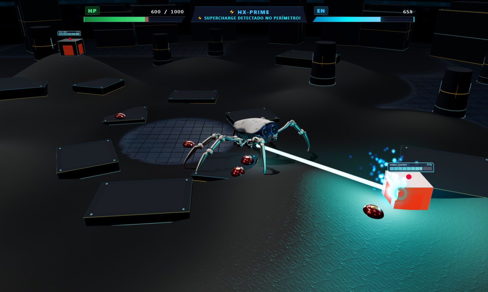

# 🤖 HexaBOT — Tactical Mech Engine & IK Research

[](https://sandrobenigno.github.io/HexaBOT/)
[](https://threejs.org/)
[](https://opensource.org/licenses/MIT)

O **HexaBOT** é um projeto de pesquisa e simulação em computação gráfica 3D focado em **Cinemática Inversa Vetorial (IK 3-DoF)**, auto-rigging procedural e locomoção para robôs hexápodes. 

A plataforma inclui uma suíte completa de ferramentas de calibração, diagnóstico e deformação de malha (*Shape Keys*), além do **HX1 Walker: Reborn** — um jogo tático de combate robótico em tempo real executado diretamente no navegador.

---

## 🎮 O Jogo: HX1 Walker: Reborn

> 🕹️ **JOGAR ONLINE**: [https://sandrobenigno.github.io/HexaBOT/hx1_walker_reborn/index.html](https://sandrobenigno.github.io/HexaBOT/hx1_walker_reborn/index.html)  
> 📖 **DOCUMENTAÇÃO DEDICADA**: [Consulte o README do Jogo](file:///x:/GEMINY/AranhaThreeJS/hx1_walker_reborn/README.md)



### Principais Destaques do Gameplay
* **Marcha Tripé com IK Analítico 3-DoF:** Solucionador trigonométrico fechado com algoritmo *Auto-Reach Fallback* em tempo constante O(1), garantindo contato firme das 6 patas sem escorregamento (*Zero Slipping*) sob qualquer aclive ou desnível.
* **Sistema de Combate & Laser de Plasma:** Disparo livre com restrição de FOV ($\pm 30^\circ$), recuo mecânico do chassi (*Shooting Shift*), colisão física por raycasting e *Welding Sparks Fountain* (faíscas incandescentes em arco parabólico com rastro inercial e glow multi-camadas).
* **Esferas de Plasma (Supercharge & Healing):**
  - **⚡ Supercharge (Azul):** Surge nos 28 monólitos perimétricos (sinalizador de 160m). Concede **500% de energia** e feixe ampliado.
  - **❤️ Regeneração / Healing (Vermelha):** Surge nos 16 tambores/cilindros de colisão da arena. Restaura **+500 HP** de vida com áudio estéreo dedicado (`healing.mp3`).
  - Coleta analítica ultrarrápida ($0\text{ms}$) ao mirar na orbe e pressionar <kbd>Espaço</kbd>.
* **Inteligência Artificial & Inimigos:** Cabines geradoras modulares com 4 portas de saída e robôs joaninhas (*LadyBUG*) com animação procedural via *Shape Keys* (`DROP`), minas de proximidade de 3s e comportamento de bando com separação física (*Anti-Nesting*).
* **Cenário Sci-Fi & Sky Dome:** Arena de $300\text{m} \times 300\text{m}$ cercada por 28 monólitos fortaleza e abóbada hemisférica de $148\text{m}$ com shader procedural GLSL (campo de força hexagonal *honeycomb*, radar ascendente e estrelas), com trava de câmera esférica anti-atravessamento.
* **Áudio Espacial & Modulação Dinâmica:** Áudio posicional 3D via *Web Audio API*, modulação contínua do pitch dos servomotores pelo movimento do tronco, envelope ADSR no canhão laser e trilhas comemorativas para a vitória (dança funk com confetes) e derrota (ritual tribal com fogueira).

### ⌨️ Controles do Jogo (HX1 Walker: Reborn)

| Comando | Ação |
| :---: | :--- |
| <kbd>W</kbd> <kbd>A</kbd> <kbd>S</kbd> <kbd>D</kbd> | Locomoção no terreno (Avanço, Recuo e Strafe Lateral) |
| <kbd>Mouse</kbd> | Mirar e Disparar Laser de Plasma Térmico |
| <kbd>Espaço</kbd> | Coletar Orbes (Supercharge / Cura) / Travar Mira / Continuar |
| <kbd>Botão do Meio (Drag)</kbd> | Órbita e rotação livre da câmera tática |
| <kbd>Scroll do Mouse</kbd> | Ajuste de Zoom da câmera (50m a 100m) |
| <kbd>P</kbd> | Pausar / Despausar a Simulação e Combate |
| <kbd>H</kbd> | Abrir / Fechar Guia Central de Ajuda in-game (Pausa automática) |
| <kbd>R</kbd> | Resetar Partida / Posição do Mech |
| <kbd>Esc</kbd> | Fechar Janelas Modais / Pausar Jogo |
| *(Oculto)* <kbd>O</kbd> | Exibir / Ocultar Painéis de Calibração, Sliders e Raio-X |

---

## 🔬 Laboratório & Ferramentas de Cinemática

A plataforma conta com uma suíte de ferramentas de engenharia e inspeção:

1. **📱 [Tool 1: Simulador Clássico & Mobile](https://sandrobenigno.github.io/HexaBOT/tools/index.html)** — Ambiente leve de simulação com balanço contínuo (*Auto-Sway*), suporte a controles touch e curva hermítica de elevação de patas.
2. **🎛️ [Tool 2: Oficina de Rigging & Exportador](https://sandrobenigno.github.io/HexaBOT/tools/index2.html)** — Laboratório universal para importação de modelos via Drag-and-Drop, detecção hierárquica por Regex, console de *Shape Keys* estilo mesa de som e exportação de manifestos biomecânicos (`.bot.json` e `.glb` com manifesto embutido).
3. **🚀 [Tool 3: Runtime com Manifesto](https://sandrobenigno.github.io/HexaBOT/tools/index3.html)** — Simulador de alta fidelidade que consome diretamente os manifestos biomecânicos com travamento milimétrico de âncoras e iluminação HDR (*RoomEnvironment*).

> 📖 **Para documentação técnica detalhada das ferramentas, consulte o [README das Tools](file:///x:/GEMINY/AranhaThreeJS/tools/README.md).**

---

## ⚡ Fundamentos Matemáticos da Cinemática

A locomoção do robô e o posicionamento das suas 6 patas assentam sobre um sistema de **Cinemática Inversa Vetorial Analítica (IK 3-DoF)** com solução trigonométrica fechada e tempo de execução determinístico O(1).

```
         (P0: Socket / Quadril)
                 O
                / \
            L1 /   \ (Coxa: Ângulo de Abertura γ)
              /     \
             O (P1: Fêmur / Joelho)
              \
            L2 \    (Solução Fechada por Lei dos Cossenos)
                \
                 O (P2: Tíbia)
                 |
               L3|
                 |
                 O (P3: Target T / Âncora no Solo)
```

---

### 1. Construção da Base Ortonormal Zero-Bank

Para garantir que o plano de flexão da pata permaneça estritamente alinhado ao alvo $\vec{T} \in \mathbb{R}^3$ sem induzir torções espúrias de rotação (*roll* ou *gimbal lock*), constrói-se diretamente uma base ortonormal $\mathbf{R}_{\text{base}} = [\mathbf{X} \mid \mathbf{Y} \mid \mathbf{Z}]$ a partir de produtos vetoriais puros:

$$
\mathbf{X} = \frac{\vec{T} - \vec{P}_0}{\|\vec{T} - \vec{P}_0\|} \gets \text{Vetor unitário diretor (linha de visada da pata)}
$$

$$
\mathbf{Z} = \frac{\mathbf{X} \times \vec{U}}{\|\mathbf{X} \times \vec{U}\|} \gets \text{Eixo da dobradiça (Hinge Axis perpendicular ao plano)}
$$

$$
\mathbf{Y} = \mathbf{Z} \times \mathbf{X} \gets \text{Vetor superior ortogonalizado à base}
$$

Onde:
* $\vec{P}_0$: Posição tridimensional da raiz articular no chassi (*socket*).
* $\vec{T}$: Posição do ponto de contato da pata no solo (*target anchor*).
* $\vec{U}$: Vetor unitário "para cima" de referência no referencial local do robô ($\vec{U} = (0, 1, 0)^T$).

A matriz de orientação canônica é obtida por:

$$
\mathbf{R}_{\text{base}} = \begin{bmatrix} X_x & Y_x & Z_x \\ X_y & Y_y & Z_y \\ X_z & Y_z & Z_z \end{bmatrix}
$$

---

### 2. Solução Trigonométrica Fechada (Lei dos Cossenos)

Posicionada a articulação da coxa $\vec{P}_1$, calcula-se a distância euclidiana $D$ até o ponto de apoio no solo:

$$
D = \|\vec{T} - \vec{P}_1\|
$$

Aplicando a Lei dos Cossenos ao triângulo formado pelos segmentos do fêmur ($L_2$), da tíbia ($L_3$) e pela distância $D$:

$$
D^2 = L_2^2 + L_3^2 - 2 L_2 L_3 \cos(\pi - \beta)
$$

Isolando o cosseno da articulação da tíbia $\beta$:

$$
\cos(\beta) = \frac{L_2^2 + L_3^2 - D^2}{2 L_2 L_3}
$$

Para garantir estabilidade numérica mesmo sob solicitações no limite da extensão física, aplica-se a função limitadora $\text{clamp}$:

$$
\beta = \arccos\Big(\text{clamp}\big(\cos(\beta), -1, 1\big)\Big)
$$

Analogamente, para o ângulo de elevação do fêmur $\alpha$, combinamos a inclinação angular do vetor diretor $\theta_{\text{target}}$ com o ângulo interno $\phi$:

$$
\cos(\phi) = \frac{D^2 + L_2^2 - L_3^2}{2 D L_2}
$$

$$
\phi = \arccos\Big(\text{clamp}\big(\cos(\phi), -1, 1\big)\Big)
$$

$$
\alpha = \theta_{\text{target}} \pm \phi
$$

---

### 3. Auto-Reach Fallback (Relaxamento Analítico O(1))

Quando o terreno acidentado ou uma rotação brusca do corpo posiciona a âncora além do alcance nominal da perna:

$$
\|\vec{T} - \vec{P}_1\| > L_2 + L_3
$$

O solver tradicional divergiria. O **Auto-Reach Fallback** calcula em tempo constante a compensação angular exata através da constante analítica de transição $K$:

$$
K = \frac{D_{\text{total}}^2 + L_1^2 - (L_2 + L_3)^2}{2 L_1 D_{\text{total}}} \gets \text{Constante geométrica analítica de transição}
$$

$$
\gamma_{\text{fallback}} = \theta_{\text{target}} + \arccos\Big(\text{clamp}\big(K, -1, 1\big)\Big)
$$

$$
\gamma_{\text{efetivo}} = \min\big(\gamma_{\text{nominal}}, \gamma_{\text{fallback}}\big)
$$

Onde:
* **$D_{\text{total}} = \|\vec{T} - \vec{P}_0\|$**: Distância total entre o quadril e a âncora no solo.
* **$L_1, L_2, L_3$**: Comprimentos físicos dos segmentos da coxa, fêmur e tíbia.
* **$\gamma_{\text{nominal}}$**: Ângulo de abertura em repouso configurado no manifesto biomecânico.
* **$\gamma_{\text{efetivo}}$**: Ângulo final aplicado à junta de abertura da coxa, garantindo contato contínuo no solo sem escorregamento (*Zero Slipping*).

---

## 📁 Estrutura do Projeto

```text
├── index.html                   # Launcher / Hub de navegação (GitHub Pages)
├── README.md                    # Documentação geral do projeto
├── hx1_walker_reborn/           # 🎮 O Jogo (Simulador Tático de Combate)
│   ├── index.html               # Ponto de entrada do jogo
│   ├── README.md                # Documentação detalhada da mecânica e arquitetura do jogo
│   ├── css/                     # Folha de estilos sci-fi (HUD, barras de status, modais)
│   ├── assets/
│   │   ├── glb/                 # Modelos 3D locais (aranha.glb, aranha_pernalonga.glb, LadyBUG.glb)
│   │   ├── img/                 # Normal maps de relevo (areia, piso, blocos, rocha)
│   │   └── mp3/                 # Efeitos sonoros espaciais e trilhas (laser, supercharge, kaboom, etc.)
│   └── src/                     # Arquitetura modular ES6 desacoplada via EventBus
│       ├── core/                # Engine 3D, EventBus e InputManager
│       ├── audio/               # SoundManager com Web Audio API espacial
│       ├── world/               # TerrainArena (PBR, blocos, Sky Dome) e CollisionSystem
│       ├── kinematics/          # IKSolver, Leg e TripodGait
│       ├── bot/                 # HexaBot, AutoSway e BotManifest
│       ├── combat/              # LaserCombat, SuperchargeManager, LadybugEnemy, CabinSpawner, EnemyManager
│       └── ui/                  # HUDController e ModelLoaderUI
└── tools/                       # 🔬 Laboratório de Cinemática e Ferramentas
    ├── index.html               # Tool 1: Simulador Clássico & Mobile
    ├── index2.html              # Tool 2: Oficina de Rigging & Exportador de Bots
    ├── index3.html              # Tool 3: Runtime com Consumo de Manifesto
    └── README.md                # Documentação técnica da suíte de ferramentas
```

---

## 🛠️ Tecnologias Principais

* **[Three.js (r160)](https://threejs.org/)** — Renderização WebGL, iluminação PBR, shaders customizados e PMREM Environment.
* **Web Audio API** — Espacialização 3D, modulação orgânica de pitch e controle de envelope ADSR.
* **JavaScript ES6 Modular** — Arquitetura de eventos desacoplada (*Publish/Subscribe*).
* **GLSL Shaders** — Shaders atmosféricos para o Sky Dome e texturização procedural com blend de relevo.
* **HTML5 Canvas & CSS3** — Interface tática translúcida de baixa latência.
